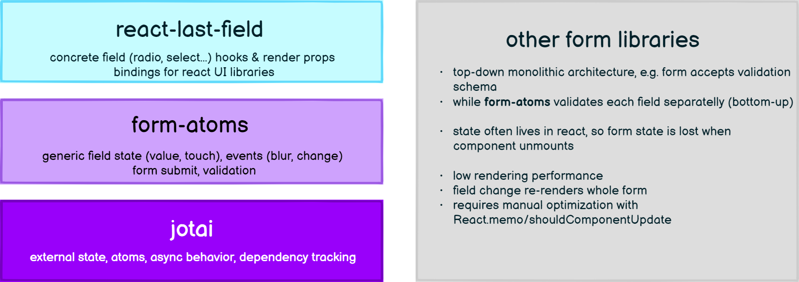

<div align="center">
  
  <h1>Atomic Form Fields for React</h1>
</div>

Declarative & headless form fields build on top of [`jotai & form-atoms`](https://github.com/jaredLunde/form-atoms).

```
yarn add jotai form-atoms @form-atoms/field
```

## Motivation

`form-atoms` is the 'last-mile' of your app's form stack. It has layered, bottom-up architecture with clear separation of concerns.
We provide you with stable pre-fabricated UI fields, while you still can go one level down and take the advantage of form primitives to develop anything you need.

To contrast it with formik or react-hook-form, our form state thanks to `jotai` lives outside of the react tree, so you never lose it when the component unmounts.
Moreover, jotai's external state unlike redux-form has compact API with 'atom-local reducer' and automatic dependency tracking leading to unmatched rendering performance.



### Key differences to other form libraries

#### No 'dotted keypath' access

Some libraries use `path.to.field` approach with field-dependent validation or when reading field at other place. We don't need such paths, as fields can be moved arround in regular JavaScript variables, as they are jotai atoms in reality.

#### Persistent form state by default

With others libraries you often lose form state when your component or page unmounts. Thats because the rendered form hook maintains the store. If the library provides a contextual API, you can opt-in into the persistence, so form state lives even when you unmount the form.

`form-atoms` on the other hand keeps the form state until you clear it, because it lives in jotai atoms. This way, you don't have to warn users about data loss if they navigate out of filled & unsubmitted form. Instead you can display 'continue where you left off' message when they return to the form.

### What's in the box?

The `form-atoms` library provides atomic form primitives capable of tracking input value, touch state, validation status and more.

`@form-atoms/field` extends these primitives & packages them into hooks & headless components (think 'smart components'), which can be easily wired to UI (think dumb components) checkbox, select or array field.

### What is a `<Field />`?

Most UI libraries provide styled primitive `<Input>` components, form `<Label>` and form `<Control>`. These must be integrated together with state & validation libraries, so when the input value is invalid, the error is propagated to the form control or the label is colored to red. The work to get this right is non-trivial and error prone.

`@form-atoms/field` provides you with **integrated field components**:

```
<Field> = <Control> + <Input> + <Label> + <HelpText> + <Error>
```

## Contents

| Hooks                                                   | About                         |
| ------------------------------------------------------- | ----------------------------- |
| [`useClearFileFieldEffect()`](#useclearfilefieldeffect) | A hook to control file input. |

## Fields

For well-known field types we export data type specific `fieldAtom` constructors. These come with
pre-defined empty value of `undefined` and a specific zod validation schema.
Similarly to `zod` schema fields, by default all the fieldAtoms are required.

### Usage

```tsx
import { numberField } from "@form-atoms/field";
import { fromAtom } from "form-atoms";
import { z } from "zod";
import { NumberField } from "@form-atoms/flowbite"; // or /chakra-ui

const height = numberField();
const age = numberField({ schema: z.number().min(18) }); // override default schema
const numOfKids = numberField({ optional: true }); // make field optional

const personForm = formAtom({ height, age, numOfKids });

export const Form = () => {
  const { submit } = useForm(personForm);

  return (
    <form onSubmit={submit(console.log)}>
      <NumberField field={height} label="Height (in cm)" />
      <NumberField field={age} label="Your age (min 18)" />
      <NumberField field={numOfKids} label="Number of kids" />
    </form>
  );
};
```

## Components

### `<FieldLabel />`

#### Features

- ✅ Focuses the associate field input when clicked.
- ✅ Text selection is prevented when double clicking label.

#### Example

```tsx
import { textField, FieldLabel } from "@form-atoms/field";

const field = textField();

// render native <label /> with htmlFor props set to field key.
<FieldLabel field={field} label="User Name" />;

// use field key as id for some input
<input id={`${field}`} />;
```

### `<RequirementIndicator />`

#### Features

- ✅ Visually indicate whether the field is optional or required.

#### Example

```tsx
import { textField, FieldLabel, RequirementIndicator } from "@form-atoms/field";

const field = textField(); // field is required by default

// Enhance the default label with requirement indicator
<FieldLabel
  field={field}
  label={
    <>
      User Name <RequirementIndicator field={field} />
    </>
  }
/>;

// Renders:
// <label>User Name (required)</label>

const optionalField = textField({ optional: true });

<FieldLabel
  field={optionalField}
  label={
    <>
      Nick Name <RequirementIndicator field={optionalField} />
    </>
  }
/>;

// Renders:
// <label>Nick Name (optional)</label>
```

### `<ArrayField />`

The array field enables you to capture list of items with the same attributes.
It offers `add` and `remove` callbacks to append new item or drop existing one.

#### Common use cases

- capture list of user addresses `{street: string, city: string, state: string}[]`
- capture list of env variables `{name: string, value: string}[]`

#### Props

| Name             | Type                                                        | Required? | Description                                                                                                                                              |
| ---------------- | ----------------------------------------------------------- | --------- | -------------------------------------------------------------------------------------------------------------------------------------------------------- |
| form             | `FormAtom<Fields>`                                          | Yes       | A form atom                                                                                                                                              |
| path             | `(string \| number)[]`                                      | Yes       | A keypath to an array in the form fields                                                                                                                 |
| builder          | `() => GetAt<FormFields, Path>`                             | Yes       | A function returning new item fields to be appended to the field array at the specified path                                                             |
| keyFrom          | `string`                                                    | Yes\*     | A keyof the array item pointing to some `FieldAtom`. When the item is of type `FormFields`. \*Optional when the array items are of type `FieldAtom<any>` |
| children         | `(props: {fields, index, RemoveItemButton}) => JSX.Element` | Yes       | A render prop accepting item fields and `RemoveItemButton` component for current array field item at `index`                                             |
| AddItemButton    | `(props: {add: () => void}) => JSX.Element`                 | No        | A render prop accepting `add` prop to instantiate new array items                                                                                        |
| RemoveItemButton | `(props: {remove: () => void}) => JSX.Element`              | No        | A render prop accepting `remove` prop to delete current item                                                                                             |

#### Features

- ✅ **Optimized rendering**. the `keyFrom` prop will use the array item's field as stable render key. This is done internally, so you don't have to specify the `key` when the list is being rendered.
  This works thanks to Jotai's atom having `toString()` method providing stable `atomKey`.
- ✅ Can render `<EmptyMessage />` when array length is 0.
- ✅ Handles adding and removal of array items.
- ✅ Supports deeply nested arrays in arrays.

#### Example - [CodeSandbox](https://codesandbox.io/s/form-atoms-field-arrayfield-example-8wdwo4?file=/src/App.tsx)

```tsx
const hobbiesForm = formAtom({
  hobbies: [{ name: fieldAtom({ value: "gardening" }) }],
});

const Hobbies = () => (
  <ArrayField
    form={hobbiesForm}
    keyFrom="name"
    path={["hobbies"]}
    builder={() => ({ name: fieldAtom({ value: "" }) })}
  >
    {({ fields, index, RemoveItemButton }) => (
      <>
        <TextField field={fields.name} label={`Hobby ${index}`} />
        {/* calls remove(index) when clicked */}
        <RemoveItemButton />
      </>
    )}
  </ArrayField>
);
```

#### Flat example

Traditionally the field array produces list of objects matching interface `FormFields[]`.
For some cases, you might want to capture list of primitives e.g. `FieldAtom<string>[]`:

```tsx
const phonesForm = formAtom({
  phones: [fieldAtom({ value: "" })], // NOTE: array of fieldAtoms
});

// NOTE: keyFrom is automatic since the array item is itself a field.
const Phones = () => (
  <ArrayField
    form={phonesForm}
    path={["phones"]}
    builder={() => fieldAtom({ value: "" })}
  >
    {({ fields, index, RemoveItemButton }) => (
      <>
        {/* NOTE: the item is itself field! */}
        <TextField field={fields} label={`Phone ${index}`} />
        {/* calls remove(index) when clicked */}
        <RemoveItemButton />
      </>
    )}
  </ArrayField>
);
```

#### Advanced example

ArrayField supports nested array fields.
For example to capture multiple people with multiple banking accounts:

```tsx
const peopleForm = formAtom({
  // level 0
  people: [
    {
      name: fieldAtom({ value: "Jerry" }),
      // level 1 (nested)
      accounts: [{ iban: fieldAtom({ value: "DE10 ..." }) }],
    },
  ],
});

// Note that for nested component we stil provide the root form instance
// the path prop to array also starts from the root
const AdvancedNestedExample = () => {
  return (
    <ArrayField
      form={peopleForm}
      keyFrom="name"
      path={["people"]}
      builder={() => ({
        name: fieldAtom({ value: "" }),
        accounts: [],
      })}
    >
      {({ fields, index, add, RemoveItemButton }) => (
        <>
          <label>Person #{index}</label> <RemoveItemButton />
          <TextField field={fields.name} label="Name" />
          <ArrayField
            form={peopleForm}
            keyFrom="iban"
            path={["people", index, "accounts"]}
            builder={() => ({ iban: fieldAtom({ value: "" }) })}
          >
            {({ fields, index, RemoveItemButton }) => (
              <>
                <label>Account #{index}</label> <RemoveItemButton />
                <TextField field={fields.iban} label="IBAN" />
              </>
            )}
          </ArrayField>
        </>
      )}
    </ArrayField>
  );
};
```

### useClearFileFieldEffect(fileField)

Since the [file input is uncontrolled react component](https://reactjs.org/docs/forms.html#the-file-input-tag), this hook will control & reset the input when the form having the fileField is reset.

## Integrations

`@form-atoms/field` comes with `<Fields />` pre-wired to popular UI libraries.

| 📦Package Docs                                                    | 🎨 Storybook                                             | 📃Official Docs                                                 | About                                          |
| ----------------------------------------------------------------- | -------------------------------------------------------- | --------------------------------------------------------------- | ---------------------------------------------- |
| [flowbite](https://github.com/MiroslavPetrik/form-atoms-flowbite) | [Flowbite Fields](https://form-atoms-field.netlify.app/) | [flowbite-react](https://flowbite-react.com/forms)              | Bindigs to Tailwind component library Flowbite |
| [chakra-ui](./packages/chakra-ui/)                                | 🚧 WIP                                                   | [chakra-ui](https://chakra-ui.com/docs/components/form-control) | Bindings to CSS-in-JS library Chakra UI        |
